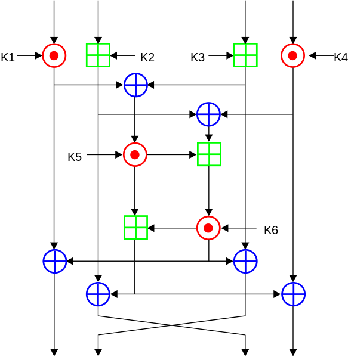

# Crypto Reference

## Implementasi IDEA

Full round

Final transformation

Kekuatan algoritma berasal dari "interleaving operation" dari berbagai Group yang berbeda, modular addition + multiplication, dan bitwise XOR.

- Bitwise XOR (direpresentasikan dengan ⊕).
- Penjumlahan modulus 216 (direpresentasikan dengan ⊞).
- Perkalian modulus 216+1 (direpresentasikan dengan ⊙).

Setiap round menggunakan 6 buah 16-bit subkeys. Sementara setengah round menggunakan 4 buah 16-bit subkeys. Total terdapat 52 key berbeda untuk 8.5 round.

## Referensi Utama

* A Proposal for a New Block Encryption Standard. [lihat](idea.pdf)

## Aplikasi