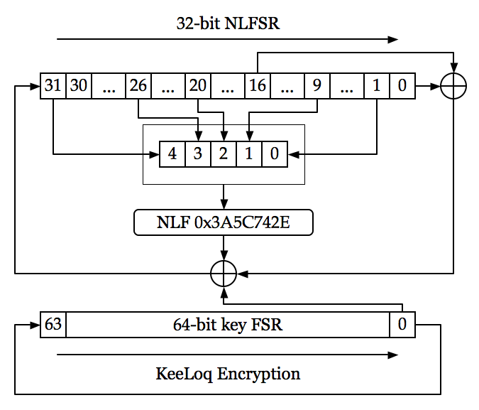
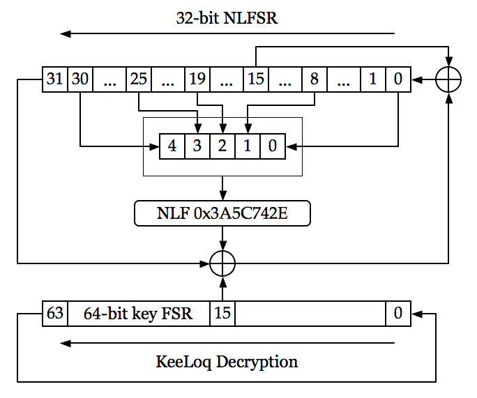

# Crypto Reference

## Implementasi KeeLoq

KeeLoq menggunakan encoder dan decoder bersifat "code-hopping" seperti NTQ105/106/116/125D/129D dan HCS101/2XX/3XX/4XX/5XX.

KeeLoq menggunakan NLFSR (Non-Linear Feedback Shift Register).

## Referensi Utama

* KeeLoq Decryption Algorithm Specification. [lihat](decryption.pdf)

## Aplikasi