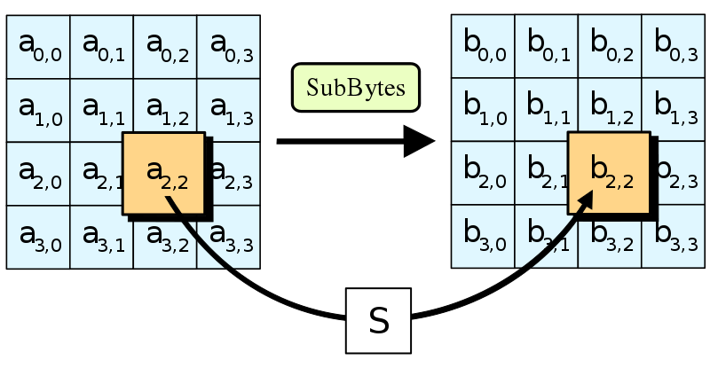
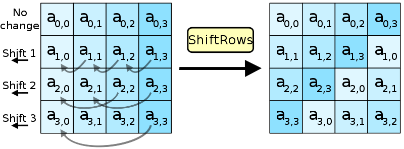
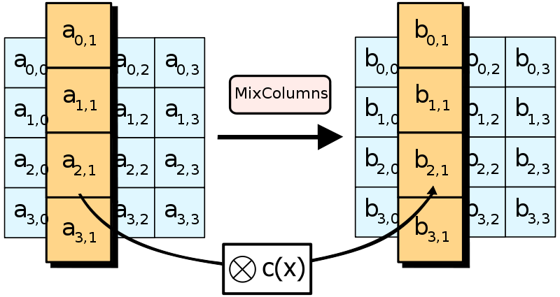
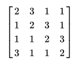
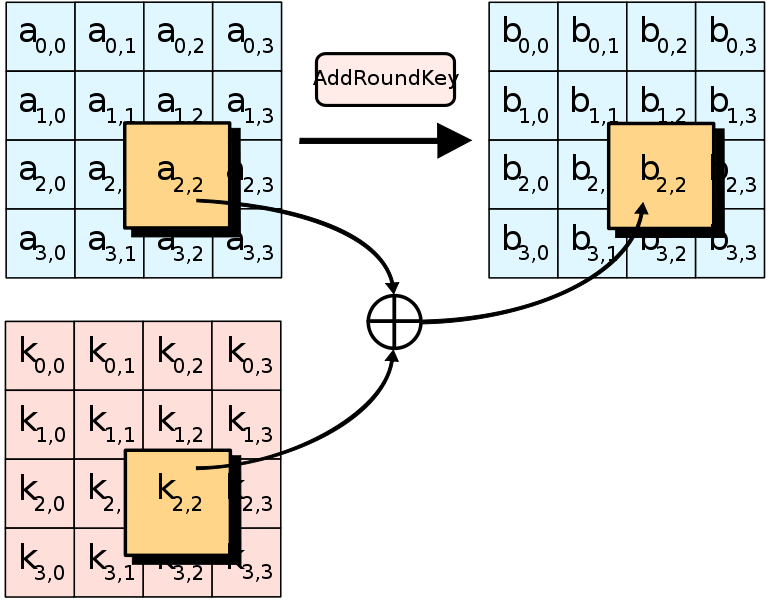

# Crypto Reference

## Implementasi Rijndael

Rijndael beroperasi dengan "column-major order" matrix berukuran 4x4 byte.

Jumlah round bergantung kepada ukuran kunci yang digunakan. Secara spesifik

- 10 cycle / round untuk ukuran kunci 128-bit
- 12 cycle / round untuk ukuran kunci 192-bit
- 14 cycle / round untuk ukuran kunci 256-bit

Rijndael dapat dideskripsikan sebagai langkah-langkah berikut:

1. KeyExpansion: round key diturunkan dari kunci menggunakan key scheduling. Diperlukan 128-bit round-key yang berbeda untuk setiap round serta satu langkah tambahan.
2. initial round: 

    * AddRoundKey: 

3. next round:

    * SubBytes
    * ShiftRows
    * MixColumns
    * AddRoundKey

4. final round:

    * SubBytes
    * ShiftRows
    * AddRoundKey

### Key Expansion & Scheduling

### Tahap SubBytes

SubBytes adalah substitusi non-linear dimana setiap byte diganti dengan byte lain yang ada di Lookup Table.

Di tahap ini, setiap byte dalam state matrix akan diganti melalui Substitution-Box (S-Box).

S-Box diturunkan dari multiplicative inverse di GF(2^8) yang dikenal memiliki non-linearity property yang bagus. 

Untuk menghindari serangan algebraic sederhana, S-Box dikonstruksi dengan mengombinasikan inverse function dengan invertible affine transformation.

Ketika dekripsi terjadi InvSubBytes dilakukan dengan melakukan inversi terhadap affine transformation kemudian menemukan multiplication inverse untuk setiap elemen.

### Tahap ShiftRows

ShiftRows adalah proses transposisi dimana tiga baris akhir dari matrix (state) akan digeser (cyclic-shift) beberapa kolom.

Pergeseran bersifat cyclic, artinya jika pergeseran menyebabkan kolom paling ujung akan berpindah ke sisi lain baris.

Pada Rijndael, baris pertama tidak berubah. Baris kedua digeser sebayak satu kolom ke kiri. Baris ketiga digeser sebanyak dua kolom ke kiri. Baris keempat akan digeser sebanyak tiga kolom ke kiri.

### Tahap MixColumns

MixColumns adalah proses mengombinasikan empat byte di setiap kolom dengan "invertible linear transformation". Proses ini membutuh empat byte sebagai input dan menghasilkan empat byte sebagai output.

Dalam operasi ini, setiap kolom akan melalui perkalian matrix dengan matrix sebagai berikut:

Perkalian matriks terdir dari perkalian dan penjumlahan tiap entri. Setiap entri / elemen matris dianggap sebagai sebuah polinomial derajat 7. Penjumlahan merupakan operasi XOR sederhana. Perkalian merupakan module irreducible polynomial x^8 + x^4 + x^3 + x + 1. 

### Add Round Key

Setiap byte state akan dikombinasikan dengan block dari round key menggunakan xor

## Referensi Utama

* 2001 - NIST FIPS 197: Advanced Encryption Standard (AES). [lihat](NIST.FIPS.197.pdf)

## Aplikasi