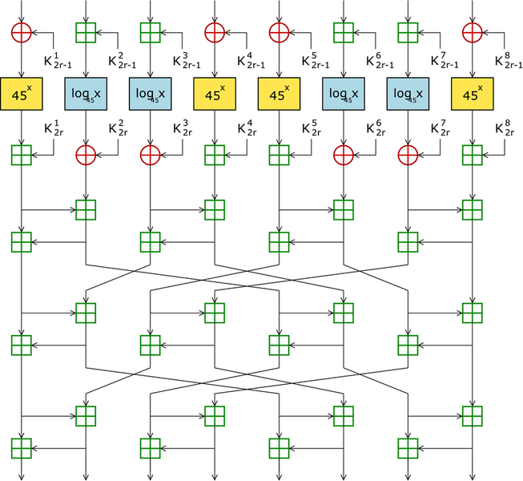

# Crypto Reference

## Implementasi SAFER

SAFER K dan SAFER SK

## Referensi Utama

### SAFER-K

* 1993 - SAFER K-64: A Byte-Oriented Block-Ciphering Algorithm. [lihat](1993.massey.pdf)
* 1994 - SAFER K-64: One Year Later. [lihat](1994.massey.pdf)

## Aplikasi

### SAFER+

* Key derivation pada Bluetooth (E21 dan E22).
* Message Authentication Code pada bluetooth (E1).