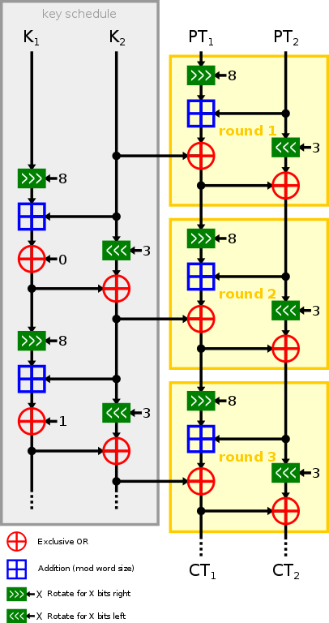

# Crypto Reference

## Implementasi Speck

## Referensi Utama

* 2013 - The Simon and Speck Families of Lightweight Block Ciphers. [lihat](2013.beaulieu_shors_smith_clark_weeks_wingers.pdf)
* 2018 - Notes on the Design and Analysis of Simon and Speck. [lihat](2018.notes.pdf)

## Aplikasi

* 2017 - The Simon and Speck Block Ciphers on AVR 8-bit Microcontrollers. [lihat](2017.beaulieu_shors_smith_clark_weeks_wingers.pdf)