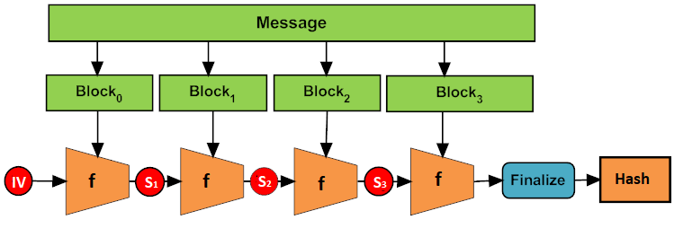

# Crypto Reference

## Merkle-Damgard Construction

_Merkle-Damgard construction_ atau _Merkle-Damgard hash function_ adalah metode untuk membangun hash function yang collision-resistant.



Merkle dan Damgard secara terpisah membuktikan bahwa jika sebuah fungsi kompresi searah f dapat dibuktikan merupakan fungsi yang collision-resistant, maka hal yang sama berlaku juga untuk konstruksi yang menggunakannya.

Dalam konstruksi ini, sebuah input pesan dianggap berukuran kelipatan dari angka tertentu, misalkan 512 atau 1024 bit. Fungsi hash membagi input menjadi beberapa block dengan ukuran tetap dan memproses satu persatu block dengan fungsi f. Tentu saja apabila ukuran input tidak mencapai kelipatan angka yang diinginkan maka proses [padding](../../padding.md) dilakukan.

Dalam struktur ini, setiap iterasi fungsi f menerima dua input yaitu block pesan dan buffer internal (internal state). Fungsi ini kemudian mentransformasikan keduanya menjadi sebuah block dan disimpan sebagai buffer internal di iterasi berikutnya.

Konstruksi ini dapat dijabarkan melalui notasi matematika sebagai berikut:

```
H[i] = f(M[i], H[i-1])

H[0] = IV
```

Seringkali diberikan sebuah fungsi yang disebut sebagai fungsi akhir (finalisation function). Fungsi ini menerima internal state dan mentransformasikannya menjadi nilai akhir hash yang akan dikembalikan oleh fungsi. Jika internal state memiliki ukuran lebih besar daripada nilai hash, maka internal state tersebut akan mengalami transformasi tertentu.
